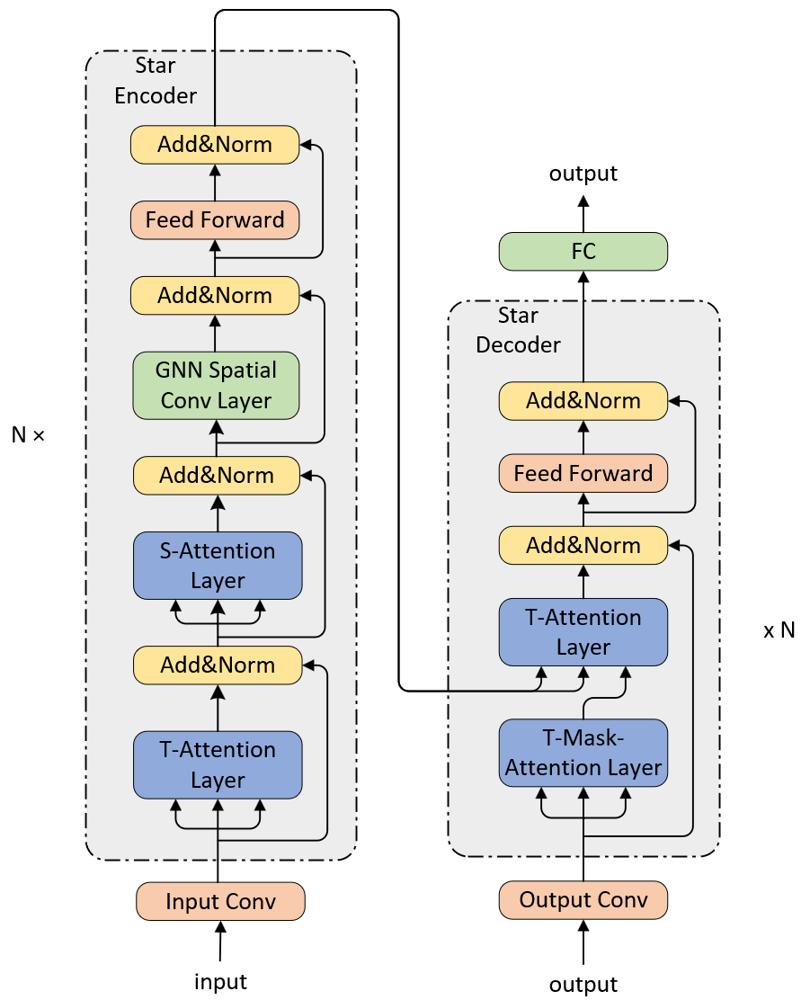
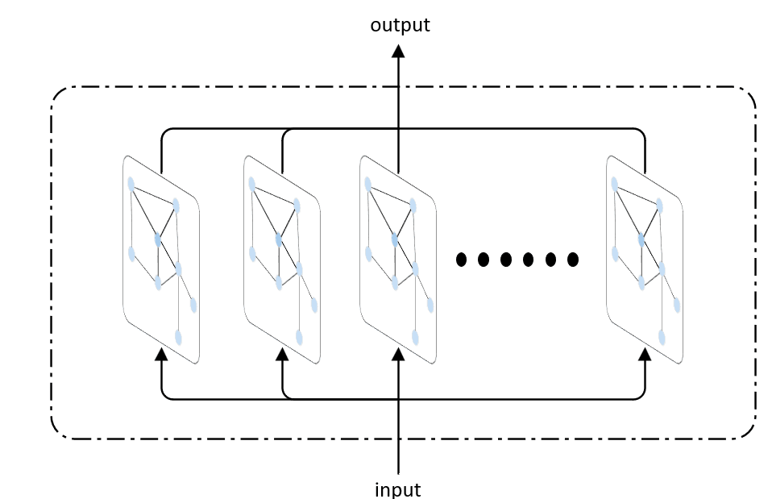

# Traffic Star Transformer
## 一、STAR-Transformer
Spatial Temporal AwaRe Transformer with GNN filter for traffic flow forecast.

具有时空感知能力的，使用GNN作为过滤器的时空Transformer

算法架构图如下:



Spatial Convolution Layer结构如下



## 二、Prepare Environment
```shell
# pytorch-gpu
pip3 install torch torchvision torchaudio --index-url https://download.pytorch.org/whl/cu121

# pytorch-geometric
pip3 install torch_geometric
pip install torch_scatter torch_sparse torch_cluster torch_spline_conv -f https://data.pyg.org/whl/torch-2.1.0+cu121.html

# tensorboardX
pip install tensorboardX

# networkx numpy pandas matplotlib scipy scikit-learn
pip install numpy pandas matplotlib networkx scipy scikit-learn

# tqdm
pip install tqdm
```

## 三、Train Model
```shell
# prepare data
python prepare_data.py --config=config/{your dataset name}_star.conf
# An example
python prepare_data.py --config=config/PEMS04_star.conf

# train model
python train_model.py --config=config/{your dataset name}_star.conf
# An example
python train_model.py --config=config/PEMS04_star.conf

# make prediction
python train_model.py --config=config/{your dataset name}_star.conf --predict=True
# An example
python train_model.py --config=config/PEMS04_star.conf --predict=True
```

## 四、Training Logs
use TensorboardX to trace the training process
```shell
tensorboard --logdir=./experiments/
```